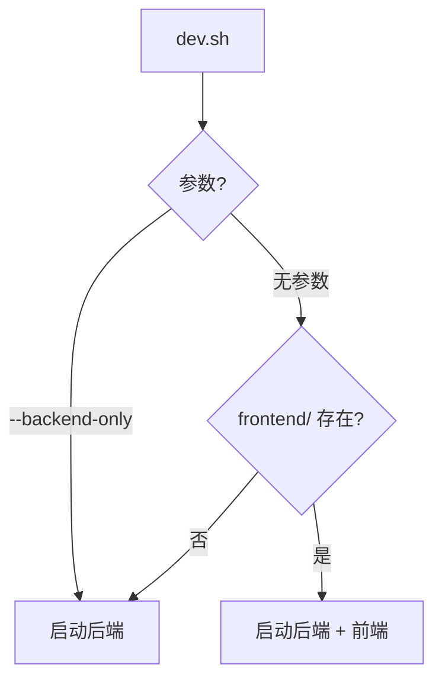

# Python Cookiecutter 模板

## 目录结构

```
cookiecutter-python-app/
├── cookiecutter.json              # 模板配置
├── create_project.sh              # 启动脚本
├── cli/
│   ├── create_project.py          # 交互式 CLI
│   └── requirements.txt           # CLI 依赖
├── hooks/
│   └── post_gen_project.py        # 后处理钩子
└── {{cookiecutter.project_name}}/
    ├── pyproject.toml             # 项目配置 (uv/pip)
    ├── .env.example               # 环境变量模板
    ├── .gitignore
    ├── README.md
    ├── scripts/
    │   ├── init_env.sh            # 环境初始化脚本
    │   ├── dev.sh                 # 开发启动脚本 (backend/frontend/all)
    │   └── example_script.py      # 示例脚本 (展示如何调用项目模块)
    ├── src/
    │   └── {{cookiecutter.project_slug}}/
    │       ├── __init__.py
    │       ├── __main__.py        # 支持 python -m {{project_slug}} 运行
    │       ├── main.py            # 入口 (FastAPI app 或 CLI)
    │       │
    │       ├── config/            # 配置模块
    │       │   ├── __init__.py
    │       │   └── env_config.py  # 环境配置 (基于现有项目)
    │       │
    │       ├── utils/             # 通用工具
    │       │   ├── __init__.py
    │       │   ├── logger.py      # 日志工具 (基于现有项目)
    │       │   └── parallel_tools_async.py  # [LLM] 异步并行工具
    │       │
    │       ├── model/             # 数据模型
    │       │   ├── __init__.py
    │       │   └── sse_message.py # [FastAPI] SSE 消息模型
    │       │
    │       ├── api/               # [FastAPI] REST 路由
    │       │   ├── __init__.py
    │       │   ├── common/
    │       │   │   ├── __init__.py
    │       │   │   └── response.py  # 通用响应结构
    │       │   ├── deps.py        # 依赖注入
    │       │   └── routes/
    │       │
    │       ├── domain/            # [分层] 领域层
    │       │   ├── entities/
    │       │   └── services/
    │       │
    │       ├── infra/             # [分层] 基础设施
    │       │   └── repositories/
    │       │
    │       └── executor/          # [LLM] LangChain 执行器
    │           ├── __init__.py
    │           └── base/
    │               ├── __init__.py
    │               └── base_llm_executor.py
    │
    ├── frontend/                  # [React] Vite + React + TailwindCSS
    │   ├── package.json
    │   ├── vite.config.ts
    │   ├── tailwind.config.js
    │   ├── postcss.config.js
    │   ├── index.html
    │   └── src/
    │       ├── main.tsx
    │       ├── App.tsx
    │       ├── index.css           # Tailwind 入口
    │       ├── router/
    │       │   └── index.tsx       # React Router 配置
    │       ├── layouts/
    │       │   └── MainLayout.tsx  # 主布局 (Sidebar + TopBar + Content)
    │       ├── components/
    │       │   ├── Sidebar.tsx     # 左侧边栏
    │       │   └── TopBar.tsx      # 顶部导航栏
    │       └── pages/
    │           ├── Home.tsx
    │           └── Settings.tsx
    │
    └── tests/
        ├── conftest.py
        └── test_main.py
```

## 用户可选配置

| 选项 | 说明 |

|------|------|

| `use_fastapi` | 是否包含 FastAPI (api/, model/sse_message) |

| `use_react` | 是否包含 React 前端 |

| `use_langchain` | 是否包含 LangChain (executor/, utils/parallel_tools_async) |

| `project_structure` | `flat` 或 `layered` |

| `python_version` | `3.8` 或 `system` (最新) |

## 通用模块 (来自现有项目)

### 1. utils/logger.py

- 基于 `logging` 标准库
- 支持控制台 + 文件双输出
- 按日期轮转日志文件 (TimedRotatingFileHandler)
- 分离错误日志 (`{app}_error.log`)
- 可配置排除 noisy 三方库日志

### 2. utils/parallel_tools_async.py

- 异步并行任务处理 (asyncio)
- 滑动窗口限流 (RPM)
- 流式进度推送 (SSE)
- 同步/异步函数自适应

### 3. config/env_config.py

- 多环境变量文件支持 (env.app, env.chat, env.embed)
- 前缀隔离配置 (APP_, CHAT_, EMBED_)
- ServerConfig / ChatConfig / EmbeddingConfig 分离

### 4. api/common/response.py

- 统一响应结构 (code, message, data)
- success() / error() / server_error() 快捷方法

### 5. model/sse_message.py

- SSE 消息标准化结构
- 阶段进度信息 (StageInfo)
- JSON 序列化 / SSE chunk 格式化

### 6. executor/base/base_llm_executor.py

- LangChain 执行器抽象基类
- 支持 run / stream / structured 三种模式
- 内置重试装饰器 (处理 429 限流)
- Embedding 创建支持

## 核心依赖

- **基础**: pydantic, pydantic-settings, python-dotenv, psutil
- **日志**: logging (标准库，TimedRotatingFileHandler)
- **测试**: pytest, pytest-cov, pytest-asyncio
- **FastAPI**: fastapi, uvicorn, httpx
- **LangChain**: langchain, langchain-openai
- **React Frontend**: react, react-dom, react-router-dom, tailwindcss, postcss, autoprefixer

## React 前端架构

### 技术栈

- **构建**: Vite + TypeScript
- **UI**: React 18 + TailwindCSS
- **路由**: React Router v6

### 布局结构 (MainLayout)

```
┌─────────────────────────────────────────────────────┐
│                    TopBar (h-16)                    │
├──────────┬──────────────────────────────────────────┤
│          │                                          │
│ Sidebar  │              Content                     │
│ (w-64)   │              (flex-1)                    │
│          │                                          │
│          │                                          │
└──────────┴──────────────────────────────────────────┘
```

### 组件说明

| 组件 | 职责 |

|------|------|

| `MainLayout.tsx` | 整体布局容器，组合 Sidebar + TopBar + Outlet |

| `Sidebar.tsx` | 左侧导航栏，支持折叠、导航链接 |

| `TopBar.tsx` | 顶部栏，显示标题、用户信息、操作按钮 |

| `router/index.tsx` | 路由配置，使用 createBrowserRouter |

### 路由配置示例

```tsx
const router = createBrowserRouter([
  {
    path: "/",
    element: <MainLayout />,
    children: [
      { index: true, element: <Home /> },
      { path: "settings", element: <Settings /> },
    ],
  },
]);
```

## 环境初始化脚本 (`scripts/init_env.sh`)

- 检测 uv/pip
- 根据 `python_version` 选择：
  - `3.8`: 使用 pyenv 或 conda 创建 3.8 环境
  - `system`: 使用系统 Python
- 创建虚拟环境并安装依赖
- 复制 `.env.example` 到 `.env`

## 开发启动脚本 (`scripts/dev.sh`)

### 用法

```bash
# 启动后端 + 前端 (如果有前端)
./scripts/dev.sh

# 仅启动后端 (纯 API 项目或调试用)
./scripts/dev.sh --backend-only
./scripts/dev.sh -b
```

### 脚本实现

```bash
#!/bin/bash
set -e

SCRIPT_DIR="$(cd "$(dirname "${BASH_SOURCE[0]}")" && pwd)"
PROJECT_DIR="$(dirname "$SCRIPT_DIR")"

# 颜色
CYAN='\033[0;36m'
GREEN='\033[0;32m'
YELLOW='\033[1;33m'
NC='\033[0m'

# 清理函数
cleanup() {
    echo -e "\n${YELLOW}> 停止服务...${NC}"
    [ -n "$BACKEND_PID" ] && kill $BACKEND_PID 2>/dev/null
    [ -n "$FRONTEND_PID" ] && kill $FRONTEND_PID 2>/dev/null
    exit 0
}
trap cleanup SIGINT SIGTERM

start_backend() {
    echo -e "${CYAN}> 启动后端服务 (port 8000)...${NC}"
    cd "$PROJECT_DIR"
    
    # 激活虚拟环境
    if [ -d ".venv" ]; then
        source .venv/bin/activate
    fi
    
    # 使用 uvicorn 启动 FastAPI
    python -m uvicorn {{cookiecutter.project_slug}}.main:app \
        --host 0.0.0.0 \
        --port 8000 \
        --reload
}

start_frontend() {
    echo -e "${CYAN}> 启动前端服务 (port 5173)...${NC}"
    cd "$PROJECT_DIR/frontend"
    
    # 检查 node_modules
    if [ ! -d "node_modules" ]; then
        echo -e "${YELLOW}安装前端依赖...${NC}"
        pnpm install
    fi
    
    pnpm dev
}

# 检查前端目录是否存在
has_frontend() {
    [ -d "$PROJECT_DIR/frontend" ] && [ -f "$PROJECT_DIR/frontend/package.json" ]
}

# 解析参数
BACKEND_ONLY=false
case "${1:-}" in
    --backend-only|-b)
        BACKEND_ONLY=true
        ;;
    --help|-h)
        echo "用法: $0 [选项]"
        echo ""
        echo "选项:"
        echo "  (无参数)        启动后端 + 前端 (如果有)"
        echo "  --backend-only, -b  仅启动后端"
        echo "  --help, -h      显示帮助"
        exit 0
        ;;
    "")
        ;;
    *)
        echo "未知参数: $1"
        echo "使用 --help 查看帮助"
        exit 1
        ;;
esac

# 启动服务
if [ "$BACKEND_ONLY" = true ]; then
    start_backend
elif has_frontend; then
    echo -e "${GREEN}> 检测到前端项目，同时启动后端和前端${NC}"
    
    # 后台启动后端
    start_backend &
    BACKEND_PID=$!
    
    # 等待后端启动
    sleep 2
    
    # 后台启动前端
    start_frontend &
    FRONTEND_PID=$!
    
    # 等待任意进程退出
    wait
else
    echo -e "${GREEN}> 未检测到前端项目，仅启动后端${NC}"
    start_backend
fi
```

### 行为逻辑



### 端口配置

| 服务 | 默认端口 | 环境变量 |

|------|----------|----------|

| Backend (FastAPI) | 8000 | `APP_PORT` |

| Frontend (Vite) | 5173 | - |

### 前后端联调

`frontend/vite.config.ts` 配置代理：

```typescript
export default defineConfig({
  server: {
    port: 5173,
    proxy: {
      '/api': {
        target: 'http://localhost:8000',
        changeOrigin: true,
      },
    },
  },
});
```

## 本地脚本执行支持

### 问题

在项目根目录运行 `python scripts/my_script.py` 时，无法直接 `import` 项目模块。

### 解决方案

**方案 1: pyproject.toml 配置 (推荐)**

```toml
[project]
name = "{{cookiecutter.project_slug}}"

[tool.setuptools.packages.find]
where = ["src"]

[project.scripts]
{{cookiecutter.project_slug}} = "{{cookiecutter.project_slug}}.main:main"
```

安装后可直接使用：

```bash
# 开发模式安装
pip install -e .

# 然后在任意脚本中导入
from {{cookiecutter.project_slug}}.utils.logger import logger
```

**方案 2: 脚本内添加路径 (无需安装)**

`scripts/example_script.py`:

```python
#!/usr/bin/env python3
import sys
from pathlib import Path

# 将 src 目录添加到 Python 路径
sys.path.insert(0, str(Path(__file__).parent.parent / "src"))

# 现在可以正常导入
from {{cookiecutter.project_slug}}.utils.logger import logger
from {{cookiecutter.project_slug}}.config.env_config import server_config

def main():
    logger.info("Script started")
    # 你的业务逻辑

if __name__ == "__main__":
    main()
```

**方案 3: python -m 运行**

```bash
# 从项目根目录运行
cd {{cookiecutter.project_name}}
python -m {{cookiecutter.project_slug}}
```

需要 `src/{{cookiecutter.project_slug}}/__main__.py`:

```python
from .main import main

if __name__ == "__main__":
    main()
```

### 推荐用法

| 场景 | 推荐方式 |

|------|----------|

| 开发调试 | `pip install -e .` + 直接导入 |

| 一次性脚本 | 方案 2 (sys.path.insert) |

| 生产运行 | `python -m {{project_slug}}` 或 CLI 命令 |

## 实现要点

1. **hooks/post_gen_project.py**: 根据选项删除不需要的目录

   - 不选 FastAPI → 删除 `api/`, `model/sse_message.py`
   - 不选 LangChain → 删除 `executor/`, `utils/parallel_tools_async.py`
   - 不选 React → 删除 `frontend/`
   - flat 结构 → 删除 `domain/`, `infra/`

2. **模块导入路径调整**: 模板中使用相对导入或 `{{cookiecutter.project_slug}}` 前缀

3. **配置简化**: env_config.py 根据选项精简配置类 (如不选 LangChain 则移除 ChatConfig/EmbeddingConfig)

4. **脚本支持**: 

   - 生成 `__main__.py` 支持 `python -m` 运行
   - 提供 `scripts/example_script.py` 作为本地脚本模板
   - `pyproject.toml` 配置 editable install